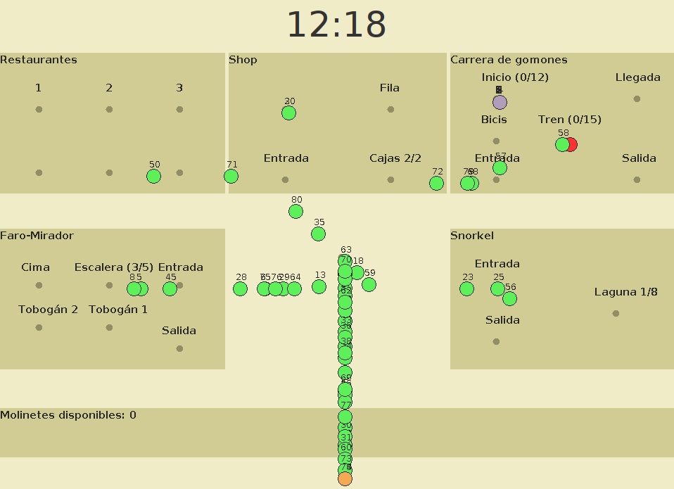
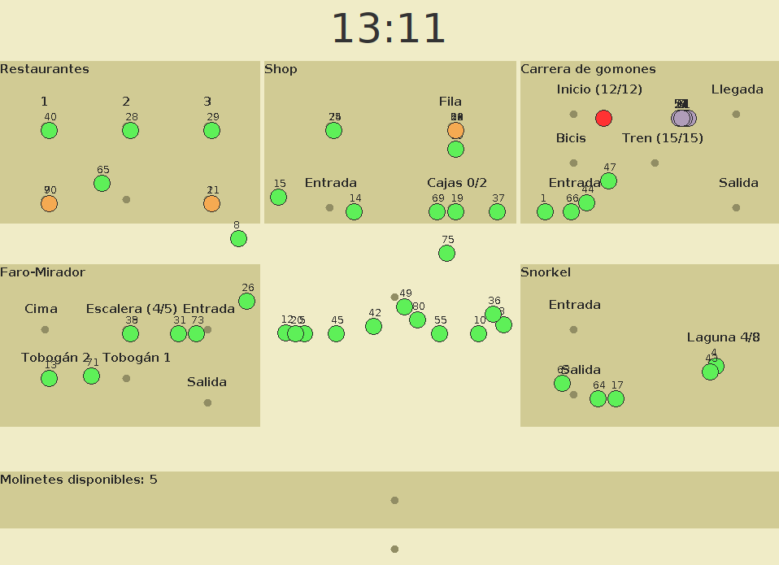

<!-- SUMMARY -->
<div align="center">

# Escape House

Java based desktop app to simulate (using concurrency) a park with different activities following [this assignment](https://drive.google.com/file/d/1gqlGlW4VwnxD9cjiw8ZtB4XGpuEyM4_n/view?usp=sharing)

[![Licence][license-shield]](./LICENSE)

</div>

<!-- SCREENSHOTS -->
<details> <summary>Screenshots</summary>




</details>

<!-- BUILT WITH -->
## Built With

- [![JAVA][java-shield]][java-url]

<!-- GETTING STARTED -->
## Getting Started

- Go to the most recent [release](https://github.com/facundoMunoz/eco-pcs-park/releases) and download the .jar

### Prerequisites

- [Java Runtime Enviroment](https://www.java.com/en/download/manual.jsp)

<!-- USAGE -->
## Usage

- Open cmd in the directory where the jar was downloaded and use the following command:
```
java -jar [latest-version].jar
```

<!-- CONTACT -->
## Contact
[![GITHUB][personal-shield]][personal-url] [![LINKEDIN][linkedin-shield]][linkedin-url]

<!-- MARKDOWN LINKS AND IMAGES -->
<!-- BUILT WITH -->
[java-shield]: https://img.shields.io/badge/java-%23ED8B00.svg?style=for-the-badge&logo=java&logoColor=white
[java-url]: https://www.java.com/en/
<!-- LICENSE -->
[license-shield]: https://img.shields.io/github/license/Ileriayo/markdown-badges?style=for-the-badge
<!-- MY GITHUB -->
[personal-shield]: https://img.shields.io/badge/FACUNDO-MU%C3%91OZ-yellowgreen?style=for-the-badge
[personal-url]: https://github.com/facundoMunoz
<!-- MY LINKEDIN -->
[linkedin-shield]: https://img.shields.io/badge/linkedin-%230077B5.svg?style=for-the-badge&logo=linkedin&logoColor=white
[linkedin-url]: https://www.linkedin.com/in/facundomunozdev/
